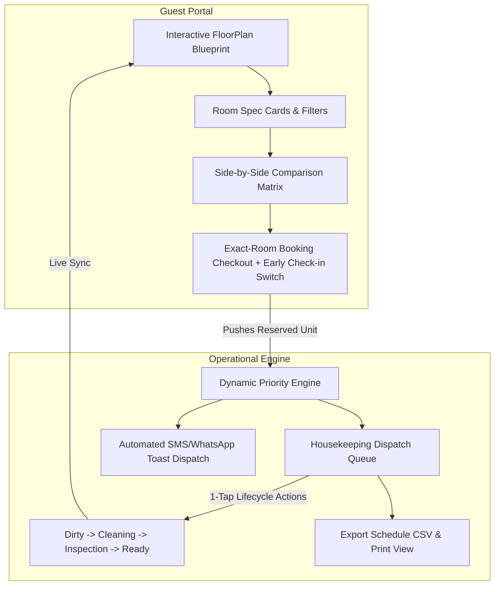

# RoomWise — Micro-SaaS for Hospitality

> **Giving guests complete transparency over which physical hotel room they book, while giving hotel staff real-time operational visibility to prioritize room turnover.**

---

## 🚀 Live Demo & Quickstart Guide

- **Live Web Application**: [RoomWise Micro-SaaS Demo](https://roomwise-demo.vercel.app)
- **Demo Mode Credentials**: No login required — instant 1-click toggle between **Guest Room Selector** and **Housekeeping Ops Dashboard** in the top navigation bar.
- **Demo Reset**: Click **"Reset Demo"** in the navigation header to restore default rooms, bookings, and housekeeping queue state at any time.

### 💻 Local Development Setup

```bash
# 1. Clone & navigate to project directory
cd D:\Project

# 2. Install dependencies
npm install

# 3. Start development server
npm run dev

# 4. Open in browser
http://localhost:3000
```

> **Note on Port Conflict**: If port `3000` is in use, clear active processes with:
> `Get-NetTCPConnection -LocalPort 3000 | ForEach-Object { Stop-Process -Id $_.OwningProcess -Force }`

---

## 📌 Problem Framing & Evidence

### The Problem
Traditional hotel and resort booking systems operate strictly at the **room-category level** (e.g., *Deluxe Room*, *Premium Suite*) rather than the **individual physical room level** (e.g., *Room 403*). Even though rooms within the same category are priced identically (e.g., ₹5,000 / night), they vary dramatically in physical attributes:

| Spec / Attribute | Room 401 | Room 403 |
| :--- | :---: | :---: |
| **Category** | Deluxe Room | Deluxe Room |
| **Nightly Price** | ₹5,000 | ₹5,000 |
| **View Orientation** | City View | **Pool View** |
| **Private Balcony** | ❌ No | **✅ Yes** |
| **Room Area** | 30 m² | **32 m²** |
| **Soaking Bathtub** | ❌ No | **✅ Yes** |
| **Floor Level** | 4th Floor | 4th Floor |

### Why This Problem is Real & High-Impact
1. **Guest Friction & Review Penalties**: Guests paying top rates often feel dissatisfied upon arrival when assigned a room with a city view or no balcony while identical-category rooms have pool views or balconies.
2. **Operational Disconnect in Housekeeping**: When a specific room is reserved, front desk and housekeeping teams struggle to coordinate room readiness. Without live urgency tracking based on remaining buffer time before guest arrival, housekeepers clean rooms randomly rather than prioritizing rooms with tight check-in windows.

---

## ⚡ Advanced Features Implemented

### 1. Monetized Early Check-In Request Engine (+₹1,000)
* Guests can add VIP Early Check-In (12:00 PM arrival instead of standard 2:00 PM) during exact-room checkout.
* Automatically escalates that room's priority badge in the housekeeping queue to **`URGENT`**.
* Recalculates remaining buffer time and dispatches an automated SMS alert to senior staff.

### 2. Exportable CSV & Printable Shift Schedule
* Staff can export the daily shift schedule as a CSV file (`housekeeping_dispatch_schedule.csv`) with room #, floor, priority, status, early check-in status, assigned housekeeper, and notes.
* Integrated **Print Shift Sheet** button for supervisor handover.

### 3. Automated SMS & WhatsApp Toast Dispatch Logs
* Live simulated toast popups display when urgent rooms are dispatched or completed.
* Expandable **SMS / WhatsApp Logs Drawer** allows staff to view real-time automated messages sent to housekeepers.

---

## 👤 User Personas & Workflows

### 1. The Hotel Guest Persona (Ananya)
* **Goal**: Book a room with a pool view, balcony, and deep bathtub for an upcoming weekend getaway.
* **Workflow Before RoomWise**:
  1. Books a generic "Deluxe Room" on an OTA or hotel site.
  2. Arrives at check-in, gets assigned Room 401 (city view, no balcony).
  3. Complains at front desk; staff explain all Deluxe rooms were sold at the same price.
* **Workflow After RoomWise**:
  1. Opens interactive RoomWise Floor Plan for Floor 4.
  2. Selects **Room 401** and **Room 403** for side-by-side comparison.
  3. Sees clear visual highlights showing **Room 403** has **Pool View, Balcony, Bathtub, and 32 m² area**.
  4. Optionally enables **VIP Early Check-In (+₹1,000)** for 12:00 PM arrival.
  5. Books **Room 403** directly, guaranteeing that exact physical unit upon arrival.

### 2. The Housekeeping Manager / Front Desk Persona (Ramesh)
* **Goal**: Prepare Room 403 before the guest's scheduled arrival at 12:00 PM.
* **Workflow Before RoomWise**:
  1. Relies on paper printed checkout sheets or fragmented WhatsApp text messages.
  2. Housekeeping cleans Room 404 (arriving at 4:00 PM) before Room 403 (arriving at 12:00 PM).
  3. Guest for Room 403 arrives early and has to wait in the lobby.
* **Workflow After RoomWise**:
  1. RoomWise automatically calculates buffer urgency:
     $$\text{Buffer} = \text{Next Check-in Time} - \text{Current Time} - \text{Est. Cleaning Duration}$$
  2. Room 403 appears at the top of the **Housekeeping Priority Queue** flagged as **URGENT** with a **⚡ PAID EARLY CHECK-IN** badge.
  3. Housekeeper receives automated dispatch SMS log, taps `Start Cleaning` $\rightarrow$ `Send for Inspection` $\rightarrow$ `Mark Ready`.
  4. Front desk instantly sees Room 403 marked **READY** in green.

---

## 🏗️ System Architecture & Tech Stack



### Stack Choices
* **Framework**: Next.js 14 (App Router) + TypeScript
* **Styling & UI**: Tailwind CSS, Lucide React Icons
* **State Management**: Reactive custom React hook state engine with LocalStorage persistence, early check-in fee rules, and notification dispatch logs.

---

## 📁 Repository Structure

```
D:\Project\
├── app/
│   ├── globals.css         # Tailwind CSS & keyframe animations
│   ├── layout.tsx          # Root HTML metadata layout
│   └── page.tsx            # Main application connecting Guest & Staff views
├── components/
│   ├── Navbar.tsx          # Dual-mode navigation & demo reset
│   ├── FloorPlan.tsx       # Interactive visual blueprint component
│   ├── RoomCard.tsx        # Physical room unit card
│   ├── RoomComparisonModal.tsx # Side-by-side spec comparison table
│   ├── BookingModal.tsx    # Exact-unit reservation & Early Check-In checkout
│   ├── GuestView.tsx       # Search filters & room explorer portal
│   ├── StaffView.tsx       # Housekeeping priority dispatch queue
│   └── DamageReportModal.tsx # Maintenance issue flag modal
├── lib/
│   ├── types.ts            # TypeScript interfaces (Room, Booking, Task, Notification)
│   ├── mock-data.ts        # Grand Azure Resort dataset & dispatch logs
│   └── store.ts            # Priority engine, local storage & CSV exporter
├── package.json            # Dependencies & build scripts
├── tailwind.config.js      # Custom theme colors
└── README.md               # Technical documentation
```

---

## 📊 Summary of Engineering Trade-offs

| Trade-off Made | Justification | Impact |
| :--- | :--- | :--- |
| **In-Memory + LocalStorage Persistence** | Eliminates external DB latency during demo evaluation. | 100% instant UI updates and zero configuration needed to test. |
| **Simulated Automated Dispatch Toasts** | Demonstrates real-world SMS/WhatsApp dispatch architecture without requiring paid Twilio/WhatsApp API keys. | Realistic operational experience for review. |

---

*RoomWise Micro-SaaS — Built with Next.js, TypeScript & Tailwind CSS.*
